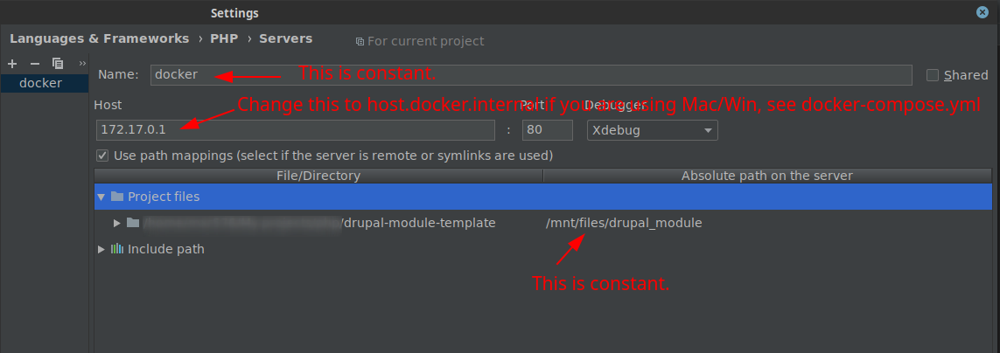
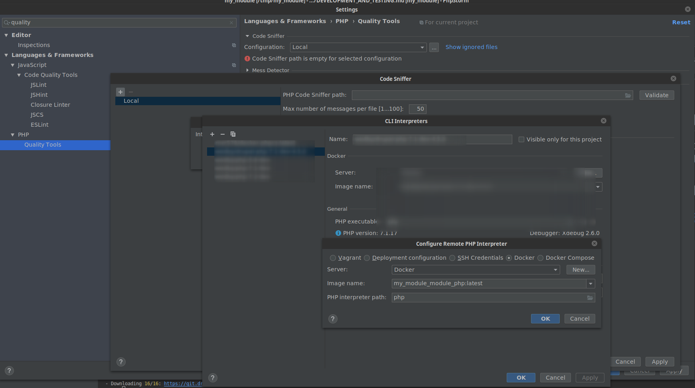
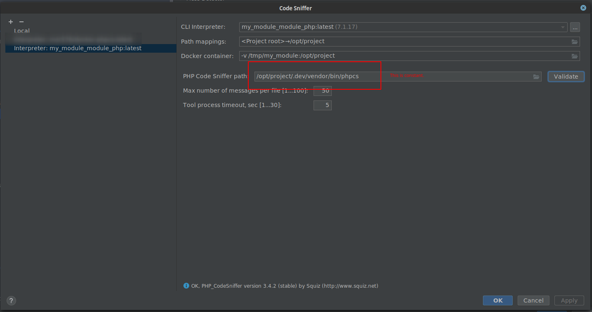
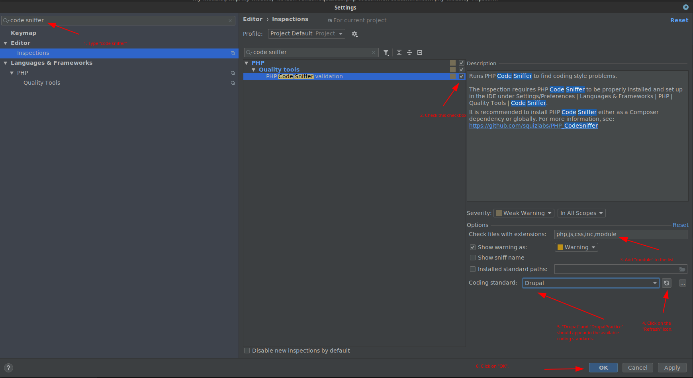

# Development

All commands below should be executed in the `.dev` folder unless it is described otherwise.

### Initial setup

```sh
$ docker-compose up -d
$ docker-compose exec php composer install
$ docker-compose exec php ./vendor/bin/run drupal:site-setup # This installs a (disposable) new site with the _minimum_ install profile and enables the module.
```
### Regular tasks

#### Logging in to the dev environment:

```sh
$ docker-compose exec php drush uli
```

This command returns an output like this: `http://webserver/user/reset/1/1561455114/sKYjEf26WZ6bzuh-KrNY425_3KCppiCHI8SxKZ158Lw/login`.

Check the _current_ port of the running webserver container with `docker-compose ps webserver`:

```sh
              Name                            Command               State           Ports        
-------------------------------------------------------------------------------------------------
my_module_webserver   /docker-entrypoint.sh sudo ...   Up      0.0.0.0:32794->80/tcp
```

Replace the `webserver` in the login url with `localhost:[PORT]`, like: http://localhost:32794/user/reset/1/1561455114/sKYjEf26WZ6bzuh-KrNY425_3KCppiCHI8SxKZ158Lw/login.

**Note: The exposed port changes every time when the `webserver` container restarts.**

#### Configuring xDebug in PHPStorm



#### Configuring PHPCS in PHPStorm

Considering that your module's machine name is "my_module".

0. Follows the steps from the "Initial setup" section.

1. Follow the steps from ["Configuring Remote PHP Interpreters >> Docker"](https://www.jetbrains.com/help/phpstorm/configuring-remote-interpreters.html) section to register the `php` image that belongs to your module.
If your module's name is "my_module", you find a `my_module_module_php:latest` image in the list of available Docker images.



2. Follow the steps from ["PHP Code Sniffer > Configure a PHP Code Sniffer script associated with a PHP interpreter "](https://www.jetbrains.com/help/phpstorm/using-php-code-sniffer.html) section and select the "Interpreter: my_module_module_php:latest" PHP interpreter that you registered in the previous steps and *click on the Apply button**[]: 



3. Active the "PHP Code Sniffer validation".



##### Troubleshooting

* If "Drupal" and "DrupalPractice" coding standards do not appear in the lists, try to run `docker-compose exec php composer update none` in the `.dev` folder and start over from the 3rd step.


#### Tips

* Run `docker-compose exec php bash` to open an interactive shell which allows to run any commands (ex.: `drush`, `composer`, etc.) inside the container directly.
* Run a command as root inside the `php` container: `sudo -u root [COMMAND]`


#### TODOs

* Document how to use module specific PHPCS configuration from phpcs.yml in PHPstorm (if it is possible).
